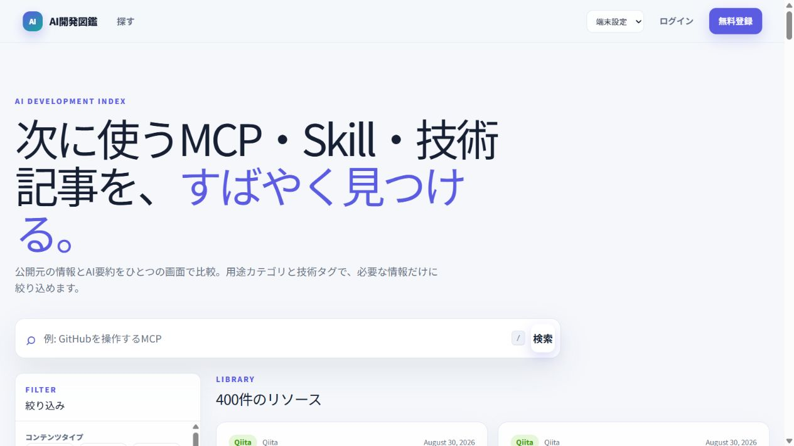
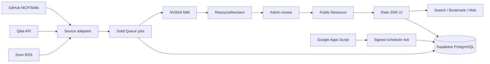

# AI開発図鑑

MCP、Agent Skills、Zenn/Qiita記事を、出典付きAI要約と管理された分類で探せる日本語のAI開発ライブラリーです。

[](https://github.com/watawatan1984/ai-dev-zukan/actions/workflows/ci.yml)
[](.ruby-version)
[](Gemfile.lock)

**[公開デモを見る (zukan.by0.uk)](https://zukan.by0.uk/)** ・ **[設計判断を読む](docs/decisions)** ・ **[Forkして動かす](#forkして試す)**



## なぜ作ったか

AI開発の情報は毎日増えています。MCPサーバーはGitHubに散らばり、Agent Skillsは名前だけでは用途が分かりにくく、ZennやQiitaの記事は媒体をまたいで探す必要があります。スター数やいいね数は人気の目安になりますが、「自分の作業に使えるか」までは教えてくれません。

AI開発図鑑は、その探索コストを下げるための小さなサービスです。MCP、Skills、Zenn、Qiitaを横断して集め、AI要約、投稿日、投稿者、人気、カテゴリ、タグをカードで見られるようにしました。気になるリソースはブックマークでき、不要なものは非表示にできます。

## 誰の何を解決するか

| 対象 | 困りごと | AI開発図鑑でできること |
| --- | --- | --- |
| AI開発を追いたいエンジニア | GitHub、Zenn、Qiitaを毎回見に行くのが重い | 4種類のリソースを1画面で横断検索する |
| MCP/Skillsを試したい人 | READMEを読む前に用途の当たりを付けたい | AI要約、スター数、カテゴリ、タグから候補を絞る |
| 自分用の技術ライブラリーを作りたい人 | 収集元や分類軸を自分向けに変えたい | forkしてtaxonomyやsource adapterを差し替えられる |

## 数字で見る初回リリース

初回リリースでは、AI要約済みの合計400件を本番公開しました。同じ400件をチェックサム付きsnapshotとしてリポジトリにも同梱し、空の環境へ再現可能な形で投入できます。

| 種類 | 件数 | 主な取得元 |
| --- | ---: | --- |
| MCP | 100 | GitHub REST API |
| Skills | 100 | GitHub REST API |
| Zenn記事 | 100 | Zenn RSS |
| Qiita記事 | 100 | Qiita API |

初回公開時の本番検証では、14カテゴリ、68件の表示タグ、件数0の絞り込み項目が0件であることを確認しました。MCP + Skills、Zenn + Qiita、カテゴリ、タグの複数選択OR検索も公開環境で検証しています。

初期データは[`db/seed_data/initial_catalog.json`](db/seed_data/initial_catalog.json)に保存しています。APIキーや秘密情報は含めず、出典URL、上限付き出典抜粋、AI要約、生成条件、分類情報だけを保持します。

## 主な機能

- 公開検索、詳細ページ、元記事/元リポジトリへの遷移
- 出典付きAI要約、投稿日、更新日、投稿者、人気指標のカード表示
- MCP、Skill、Blogの複数選択検索
- Blog内のZenn/Qiita source絞り込み
- カテゴリ、タグ、公開時期、人気順、新着順、全文検索
- 同じfacet内はOR、異なるfacet間はANDで検索
- ログイン、ログアウト、メール確認、Google OAuth
- ブックマーク、非表示、マイページ
- 管理者による手動追加、候補編集、承認公開、監査ログ
- GitHub、Qiita、Zennからの自動取込
- NVIDIA NIM adapterによるバックエンドAI要約とAI分類
- Solid Queueによる非同期処理
- ライト、ダーク、システムテーマ切り替え
- SSR、canonical、JSON-LD、sitemap、robots
- GASによるRender/Supabaseの停止リスク低減

## 設計でこだわったこと

### 自動取込しても、自動公開しない

外部APIやAI要約の結果をそのまま公開すると、誤分類や低品質な要約が混ざります。このアプリでは`Resource`と`ResourceRevision`を分け、公開画面は承認済みの`current_revision`だけを参照します。

自動取込で作られるのは公開候補です。管理者が出典抜粋、AI要約、カテゴリ、タグを確認し、必要なら編集してから「承認して公開」します。承認操作は監査ログに残します。

### 分類はAIに作らせず、人間が粒度を決める

最初の分類では、400件に対してカテゴリ233種類、タグ1,233種類まで増えました。似た名前、一度しか出ない名前、利用者が検索意図として選べない名前が増え、UIを複数選択にしても検索体験は改善しませんでした。

そこでカテゴリを「使用シチュエーション」を表す14種類へ整理し、タグも管理語彙から選ばせる方式へ変えました。AIは自由にカテゴリやタグを作れません。管理者が語彙を管理し、AIはその中から候補を出します。

### 検索は排他的にしない

MCPだけ、記事だけ、Rubyだけ、という単独条件では実際の探索に足りません。たとえば「RubyかRailsに関係する、MCPまたはBlog」を見たい場面があります。

そのため、content type、source、カテゴリ、タグはいずれも複数選択できます。同じfacet内はOR、facet同士はANDで組み合わせます。選択中の条件はchipで表示し、個別解除と全解除ができます。

### 無料枠でも動くように、重い処理を画面表示から切り離す

ユーザーのアクセス時に外部取得やAI要約を実行しません。GitHub、Qiita、Zennの取込とNVIDIA NIMによる要約/分類は、Solid Queueのjobとして裏側で処理します。

本番DBはSupabase PostgreSQLに集約し、Solid Queueも同じDBを使います。Render Freeの単一Web Serviceでも扱いやすいよう、jobは短く、再実行可能で、冪等にしています。

### SEOはRails SSRを活かす

Railsの通常ViewでSSRするため、検索エンジンはAI要約を含むHTMLを直接読めます。詳細ページにはJSON-LDを出し、sitemapとcanonicalも用意しています。

一方で、任意のfilter組み合わせページを全部indexさせるとSEO URLが増えすぎます。絞り込み済み検索ページは`noindex, follow`にし、詳細ページを主な検索流入先にします。

## 失敗して修正したこと

| 失敗 | 原因 | 修正 |
| --- | --- | --- |
| カテゴリ233種類、タグ1,233種類まで増えた | AIに自由分類させたため、粒度と命名が揃わなかった | 14カテゴリと管理タグへ統合し、AIは許可語彙から選ぶ方式に変更 |
| 検索条件が期待とズレた | 種類、カテゴリ、タグが排他的なUIだと探索の実態に合わなかった | 複数選択、facet内OR、facet間ANDへ変更 |
| 既存公開データに古いカテゴリが残った | snapshot更新だけでは本番のlegacy categoryが非表示にならなかった | legacy categoryを削除せずdeactivateするmigrationを追加 |
| Render Free/Supabase Freeの停止リスクがあった | アクセスが少ない時間帯にWeb/DBが眠る | GASからJST 10:00-20:59に10分間隔で署名付きtickを送り、Rails側で`SELECT 1`を確認 |
| CIでsystem testの前提が崩れた | テストコードが環境依存のAPIやURL判定に寄っていた | supported APIとquery parameter境界の検証へ修正 |

失敗は隠さず、設計の理由として残しています。特に分類を作り直した経緯は[ADR 0006](docs/decisions/0006-controlled-taxonomy-faceted-search.md)へ、その他の判断も[Decision records](docs/decisions)へ記録しています。

## 技術スタック

| 領域 | 採用技術 | 用途 |
| --- | --- | --- |
| Backend | Ruby 3.4.4, Rails 8.1.3.1 | SSR、認証、管理画面、検索、job投入 |
| Frontend | Hotwire, Stimulus, Tailwind CSS | 軽量な操作感、検索UI、テーマ切替 |
| Database | Supabase PostgreSQL | Resource、Revision、ユーザー操作、Solid Queueを保存 |
| Queue | Solid Queue | 外部取込、AI要約、AI分類 |
| Deploy | Render Docker Web Service | Free plan前提の公開環境 |
| Storage | Cloudflare R2 | S3互換のActive Storage保存先 |
| Auth | Devise, Google OAuth | メール認証とGoogleアカウントログイン |
| AI | NVIDIA NIM, Faraday | 要約/分類modelを環境変数で差し替え |
| Mail | Resend HTTPS API | Render FreeでSMTPを避ける |
| Scheduler | Google Apps Script | JST 10:00-20:59の署名付きkeepalive |
| Quality | Minitest, System Test, RuboCop, Brakeman, bundler-audit, importmap audit | 回帰防止、静的解析、依存関係監査 |

## アーキテクチャ概要



詳細は[Architecture](docs/ARCHITECTURE.md)を参照してください。

## Forkして試す

Docker DesktopとGitがあれば、ホストOSにRubyやPostgreSQLを直接入れずに起動できます。

```powershell
git clone https://github.com/watawatan1984/ai-dev-zukan.git
cd ai-dev-zukan
docker compose build web
docker compose run --rm web bin/rails db:prepare
docker compose run --rm web bin/rails catalog:snapshot:import
docker compose run --rm -e INITIAL_CATALOG_RELEASE=publish web bin/rails catalog:bootstrap:release
docker compose up web
```

起動後、`http://localhost:3000`を開きます。同梱snapshotを使うだけならNVIDIAや外部sourceのAPIキーは不要です。新しいデータを取得・要約するときだけ、対象APIとAI providerの環境変数を設定します。

この構成はAI開発情報に限りません。`taxonomy`とsource adapterを差し替えれば、社内技術ナレッジ、特定分野のOSS、学習教材、論文などを「自動収集だけで即公開しない」レビュー付きライブラリーへ作り替えられます。

自分用に変えるなら、まず次のファイルを見ると全体を掴みやすいです。

| 変更したいもの | 見る場所 |
| --- | --- |
| カテゴリ/タグの粒度 | [`config/taxonomy.yml`](config/taxonomy.yml) |
| GitHub/Qiita/Zennの取得処理 | [`app/integrations/sources`](app/integrations/sources) |
| AI要約/分類provider | [`app/integrations/ai`](app/integrations/ai) |
| 初期400件snapshot | [`db/seed_data/initial_catalog.json`](db/seed_data/initial_catalog.json) |
| 本番運用手順 | [Operations](docs/OPERATIONS.md) |

## テストと品質確認

```powershell
docker compose run --rm -e RAILS_ENV=test web bin/rails db:prepare
docker compose run --rm -e RAILS_ENV=test web bin/rails test
docker compose run --rm web bin/rubocop
docker compose run --rm web bin/brakeman --no-pager
docker compose run --rm web bin/bundler-audit check --update
```

GitHub Actionsでは、Rubyのsecurity scan、JavaScript dependency audit、RuboCop、Rails test、system testを実行します。Renderは`main`のchecks passを自動デプロイ条件にしています。

## 設計と運用を深掘りする

- [PRD](docs/PRD.md): 目的、MVP、対象外、成功条件
- [Architecture](docs/ARCHITECTURE.md): Resource/Revision、外部取込、AI要約、デプロイ制約
- [Operations](docs/OPERATIONS.md): Supabase、Render、GAS、初期400件投入、taxonomy更新
- [Development](docs/DEVELOPMENT.md): ローカル起動、テスト、品質確認
- [Decision records](docs/decisions): Supabase単一DB、初回公開、管理語彙、複数選択検索などの判断理由
- [render.yaml](render.yaml): Render Free、health check、initial deploy hook、checksPass deploy
- [ops/gas/scheduler.gs](ops/gas/scheduler.gs): 10分間隔の署名付きscheduler tick
- [.github/workflows/ci.yml](.github/workflows/ci.yml): CIの実行内容

## 環境変数と注意点

`.env.example`に必要な環境変数の一覧があります。ローカルではプロジェクト直下の`env`をDocker Composeが読み込みます。このファイルはGit管理しません。

NVIDIAのmodelは`NVIDIA_NIM_MODEL`で指定します。番号付きの検証用変数がある場合でも、アプリは標準名`NVIDIA_API_KEY` / `NVIDIA_NIM_MODEL`を優先します。

- Reddit、Stack Overflow、プロンプトライブラリーはMVP対象外です。
- 外部記事本文やREADME全文を再配信するサービスではありません。
- GAS keepaliveはRender/Supabase Freeの停止リスクを下げるための仕組みで、Supabase Freeが絶対に止まらないことを保証するものではありません。
- Cloudflare R2はActive Storageの保存先として構成しています。初期公開の主役は検索/要約/分類データです。
